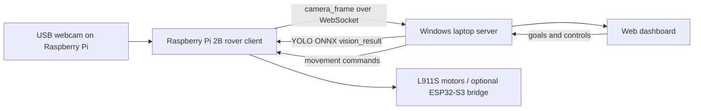

# STASIS Forest Monitoring Rover

STASIS is a prototype forest-monitoring rover built for an indoor, forest-like demo space. It is designed to patrol a small area, watch through an onboard camera, detect important forest events, and show clear alerts on a web dashboard.

The project focuses on a practical mission: help monitor places where humans, animals, fire, or unusual ground activity may need attention.

## What Judges Should Notice

| Area | What STASIS Demonstrates |
| --- | --- |
| Vision AI | Windows-side YOLO ONNX detection analyzes live Pi webcam frames for humans, animals, and important objects without forcing Torch onto the Pi. |
| Rover control | Raspberry Pi 2B controls movement, telemetry, camera capture, and final action decisions. |
| Remote dashboard | A browser dashboard shows the camera feed, rover position, alerts, and tracking guidance. |
| Indoor demo ready | No GPS is required; the rover works in a controlled demo arena. |
| Minimal wiring goal | Core responsibilities are split between the Raspberry Pi, Windows laptop, webcam, and optional ESP32-S3 motor controller. |

## Current Demo Architecture

The webcam is connected to the Raspberry Pi, not the laptop. The Raspberry Pi sends camera frames to the Windows laptop, the laptop runs YOLO from an ONNX model, and the Pi receives the result before deciding what action to take.



In plain words:

1. The Pi sees through the webcam.
2. The Pi sends the image to the Windows laptop.
3. The laptop uses YOLO ONNX to detect people, animals, and objects.
4. The laptop sends the result back to the Pi.
5. The Pi decides whether to stop, alert, remember a marker, or continue.
6. The dashboard shows the alert, map dot, and tracking guidance.

## What STASIS Detects

AI output is filtered so the project stays focused on the forest-monitoring mission.

```text
human   -> humans, intruders, people in the demo area
animal  -> animals or wildlife stand-ins
track   -> footprints, soil changes, trails, disturbed ground
fire    -> flame, smoke, or fire-like hazards
marker  -> custom navigation markers such as red strips
```

Ordinary indoor doors and windows are intentionally not treated as target classes for this demo.

The main demo detector is `server/security_rover_server_object_detection.py`, which expects an ONNX model at `server/models/yolo11n.onnx`. See [Windows YOLO ONNX Detection](docs/WINDOWS_YOLO_ONNX_DETECTION.md).

For collecting custom training photos, use the guided webcam tool in [Dataset Capture Assistant](docs/DATASET_CAPTURE_ASSISTANT.md).

## Dashboard Features

The dashboard is served from the Windows laptop:

```text
http://<WINDOWS_LAPTOP_IP>:5000
```

It provides:

- Live camera feed from the Raspberry Pi webcam.
- Rover map and clicked goal control.
- Stop, return-home, scan, red-strip search, and red-strip go-to controls.
- Human/event alert cards with a `Track` button.
- Tracking guidance in centimeters, using simple directions like `move forward`, `move left`, `move right`, and `turn back`.
- No numeric turn-angle instructions in the dashboard guidance.

## Hardware Used

| Part | Role |
| --- | --- |
| Raspberry Pi 2B | Rover brain, webcam capture, telemetry, action decisions, motor control path. |
| USB webcam | Connected to the Pi for the rover's point of view. |
| Windows laptop | Runs Flask dashboard server and selected multimodal vision processing. |
| L911S / L9110S motor driver | Drives the rover motors. |
| ESP32-S3 | Optional low-level serial motor controller for cleaner PWM motor timing. |
| Optional sensors | MPU6050, GY-271/HMC5883L, HC-SR04, and scanner servo support are included but can stay disabled for a minimal demo. |

## Quick Start

### 1. Start The Windows Server

On the Windows laptop:

```powershell
cd server
py -m venv .venv
.\.venv\Scripts\activate
python -m pip install --upgrade pip
pip install -r requirements-api.txt
copy vision_config.example.json vision_config.json
```

Edit `vision_config.json` and enable one provider. The recommended local competition setup is `moondream_stasis`, which uses Moondream for vision and a tiny text model for clean STASIS alert comments. Gemini, OpenAI, Anthropic, Qwen DashScope, Kimi, Zhipu, single-model Ollama, LM Studio, and local Gemma examples are also included.

Then start the server:

```powershell
python security_rover_server_windows.py
```

Only install the heavier local Gemma dependencies if you enable `local_gemma`:

```powershell
pip install -r requirements-windows.txt
```

The server will print an address like:

```text
http://10.139.244.74:5000
```

Use that IP address on the Raspberry Pi.

If Hugging Face authentication is needed for local Gemma:

```powershell
$env:HF_TOKEN = "hf_your_token_here"
```

The Windows server now waits for camera frames from the Raspberry Pi by default. For laptop-only testing, set:

```powershell
$env:STASIS_CAMERA_SOURCE = "local"
```

### 2. Start The Raspberry Pi Rover

On the Raspberry Pi:

```bash
cd rover/rpi2b
python3 -m venv .venv
. .venv/bin/activate
python -m pip install --upgrade pip
pip install -r requirements.txt
cp config.example.json config.json
```

Edit `config.json`:

```json
{
  "server_host": "10.139.244.74"
}
```

Plug the USB webcam into the Raspberry Pi, then run:

```bash
python rover_client.py --config config.json
```

Use `--simulate` only for network testing. Do not use simulation for the real rover demo.

### 3. Open The Dashboard

In a browser on the laptop:

```text
http://<WINDOWS_LAPTOP_IP>:5000
```

You should see the live Pi webcam feed. When the selected AI provider detects a human, fire, marker, track, or animal, the Pi receives the result, stops or continues based on the event, approves the alert, and the dashboard displays it.

## Demo Script

For a simple judging demonstration:

1. Start the Windows server.
2. Start the Raspberry Pi rover client.
3. Open the dashboard.
4. Show the live Pi webcam feed.
5. Place a person or human stand-in in view.
6. Wait for the alert card.
7. Click `Track`.
8. Show the distance in centimeters and simple guidance.
9. Use stop, scan, or red-strip controls to show rover interaction.

## Project Structure

```text
server/
  security_rover_server_windows.py    Windows Flask + Socket.IO + multimodal vision server
  vision_config.example.json          Editable provider config template
  requirements-api.txt                Lightweight API/Ollama/LM Studio server dependencies
  templates/index.html                Main live dashboard

rover/rpi2b/
  rover_client.py                     Raspberry Pi rover, camera, telemetry, decisions
  config.example.json                 Pi config template
  requirements.txt                    Pi Python dependencies
  README.md                           Pi-specific setup guide

rover/esp32_s3/
  stasis_motor_controller.ino         Optional serial motor controller firmware

dashboard/
  rover_dashboard_windows.html        Standalone dashboard option

docs/
  README_ROVER_SYSTEM.md              Full system setup and wiring guide
  VISION_PROVIDERS.md                 API, Ollama, LM Studio, and Gemma provider setup
  GEMMA_VISION.md                     Local Gemma setup and prompt contract
  PROJECT_BRIEF.md                    Mission, scope, and demo assumptions
```

## Documentation

Start here for the full build guide:

```text
docs/README_ROVER_SYSTEM.md
```

Multimodal provider setup:

```text
docs/VISION_PROVIDERS.md
```

Local Gemma setup details:

```text
docs/GEMMA_VISION.md
```

Project mission and assumptions:

```text
docs/PROJECT_BRIEF.md
```

## Current Limits

STASIS is a prototype. For the current indoor demo:

- GPS is intentionally not used.
- Distance is approximate without wheel encoders.
- Multimodal AI should run on the laptop or through an API, not on the Raspberry Pi 2B.
- Optional sensors should only be enabled after the hardware is physically connected.

These limits are documented so the demo stays honest, understandable, and focused.
