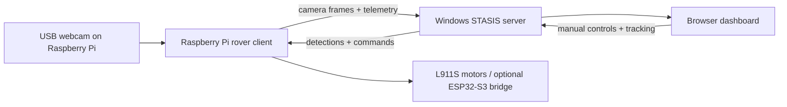

# STASIS

**A Raspberry Pi rover platform for forest-style monitoring, live camera streaming, object detection, and dashboard-guided response.**

STASIS is an open-source prototype for a small monitoring rover. It is built around a Raspberry Pi, a USB webcam, a Windows laptop for heavier vision processing, and a browser dashboard that shows what the rover sees and how it is responding.

The current build is focused on an indoor forest-like demo space: no GPS, no complicated field infrastructure, and no unnecessary hardware. The rover streams camera frames from the Raspberry Pi, the Windows server analyzes them, and the dashboard turns detections into clear alerts, map points, and simple movement guidance.

## Highlights

| Area | What STASIS Does |
| --- | --- |
| Live rover vision | Streams the Raspberry Pi webcam feed to the dashboard. |
| Human detection | Detects people and surfaces them as high-priority dashboard alerts. |
| Object and marker detection | Supports demo objects, green-strip navigation markers, and empty-background dataset collection. |
| Rover control | Sends manual, scan, stop, return-home, and marker navigation commands from the dashboard to the Pi. |
| Minimal wiring | Keeps the main system centered on the Raspberry Pi, webcam, motor driver path, and optional ESP32-S3 bridge. |
| Extensible AI | Supports local or API-based vision providers, plus custom dataset capture for training a better model. |

## System Flow

The webcam belongs on the Raspberry Pi. The laptop runs the dashboard and the heavier AI work.



In plain English:

1. The Raspberry Pi captures webcam frames.
2. The Pi sends frames to the Windows server through WebSocket.
3. The server runs the selected vision pipeline.
4. The result goes back to the Pi and appears on the dashboard.
5. The dashboard can track a detected target, show map dots, and send rover commands.

## What It Detects

STASIS keeps detections focused on the rover mission:

```text
human              people or intruders in the demo area
animal             animal stand-ins or wildlife-style targets
alpha_tester_object custom demo objects for the trained dataset
green_strip          navigation marker strips
empty_background   clean negative examples for model training
fire / track       supported in the broader alert contract
```

For the current demo, normal indoor doors, windows, and random room features should not become target alerts.

## Quick Start

### 1. Start The Windows Server

On the Windows laptop:

```powershell
cd server
py -m venv .venv
.\.venv\Scripts\activate
python -m pip install --upgrade pip
pip install -r requirements-api.txt
copy vision_config.example.json vision_config.json
python security_rover_server_windows.py
```

The server prints an address such as:

```text
http://192.168.29.69:5000
```

Use that IP in the Raspberry Pi config.

### 2. Start The Raspberry Pi Rover

On the Raspberry Pi:

```bash
cd ~/Documents/Stasis/rover/rpi2b
python3 -m venv .venv
. .venv/bin/activate
python -m pip install --upgrade pip
pip install -r requirements.txt
cp config.example.json config.json
nano config.json
```

Set `server_host` to the Windows laptop IP:

```json
{
  "server_host": "192.168.29.69"
}
```

Then run the rover client:

```bash
python rover_client.py --config config.json
```

Use `--simulate` only for network testing. For the real rover, keep simulation off.

### 3. Open The Dashboard

On the laptop browser:

```text
http://<WINDOWS_LAPTOP_IP>:5000
```

You should see the live Pi webcam feed, rover status, controls, alerts, and the tracking map.

## Dataset Capture

STASIS includes a beginner-friendly webcam capture tool for building a custom object dataset:

```powershell
python tools\dataset_capture_assistant.py
```

It captures:

- `alpha_tester_object`
- `green_strip`
- `empty_background`

The tool lets you choose camera resolution, FPS, brightness, contrast, exposure, focus, and save location from the app itself. See [Dataset Capture Assistant](docs/DATASET_CAPTURE_ASSISTANT.md).

## Project Website

This repo includes a GitHub Pages-ready website in [docs/index.html](docs/index.html).

To publish it:

1. Open the repository on GitHub.
2. Go to `Settings` -> `Pages`.
3. Set source to `Deploy from a branch`.
4. Select `main` and `/docs`.
5. Save.

GitHub will then publish the project site from the `docs` folder.

## Project Structure

```text
server/
  security_rover_server_windows.py        Windows Flask + Socket.IO dashboard server
  security_rover_server_object_detection.py
  vision_config.example.json              Vision provider configuration template
  templates/index.html                    Main dashboard UI

rover/rpi2b/
  rover_client.py                         Raspberry Pi rover client
  rover_client_object_detection.py        Pi-side camera streaming and local detection path
  config.example.json                     Pi configuration template
  requirements.txt                        Pi dependencies

tools/
  dataset_capture_assistant.py            Webcam dataset collection app

hardware/cad/stasis-design/
  inventor/                               Autodesk Inventor source parts and assemblies
  drawings/                               DWG drawing exports
  stl/                                    STL files for printing and previews

docs/
  index.html                              GitHub Pages project website
  README_ROVER_SYSTEM.md                  Full rover setup guide
  VISION_PROVIDERS.md                     Cloud/local AI provider notes
  WINDOWS_YOLO_ONNX_DETECTION.md          Windows ONNX detector guide
  DATASET_CAPTURE_ASSISTANT.md            Dataset tool guide
```

## Documentation

- [Full Rover System Guide](docs/README_ROVER_SYSTEM.md)
- [Wiring And Runbook](docs/WIRING_AND_RUNBOOK.md)
- [Vision Providers](docs/VISION_PROVIDERS.md)
- [Windows YOLO ONNX Detection](docs/WINDOWS_YOLO_ONNX_DETECTION.md)
- [Dataset Capture Assistant](docs/DATASET_CAPTURE_ASSISTANT.md)
- [Project Brief](docs/PROJECT_BRIEF.md)

## Current Limits

STASIS is still a prototype, so the current build is intentionally honest about what it can and cannot do:

- GPS is not used for the indoor demo.
- Distance and map guidance are approximate without wheel encoders.
- Heavy AI should run on the laptop or through an API, not on the Raspberry Pi 2B.
- Custom object detection quality depends heavily on the dataset and trained model.
- Optional sensors should stay disabled until the hardware is physically connected.

## License

This project is intended as an open-source learning and robotics build. Add the final license file before using it in a public release or competition submission.
