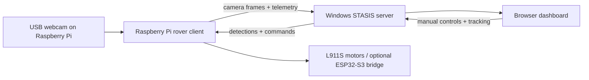

# STASIS

**A Raspberry Pi rover platform for forest-style monitoring, live camera streaming, object detection, and dashboard-guided response — built as a competition entry for field robotics and AI-integrated monitoring systems.**

STASIS is a competition-grade prototype for a small monitoring rover designed to showcase real-time edge-AI detection, telemetry-driven situational awareness, and operator-in-the-loop decision making. It is built around a Raspberry Pi 2B, a USB webcam, a Windows laptop for heavier vision processing, and a browser dashboard that shows what the rover sees and how it is responding.

The current build is focused on an indoor forest-like demo space: no GPS, no complicated field infrastructure, and no unnecessary hardware. The rover streams camera frames from the Raspberry Pi, the Windows server analyzes them, and the dashboard turns detections into clear alerts, map points, and simple movement guidance.

> **Competition Project Website:** [catkartikwastaken.github.io/Stasis](https://catkartikwastaken.github.io/Stasis)

## Highlights

| Area | What STASIS Does |
| --- | --- |
| Live rover vision | Streams the Raspberry Pi webcam feed to the dashboard. |
| Human detection | Detects people and surfaces them as high-priority dashboard alerts. |
| Object and marker detection | Supports demo objects, green-strip navigation markers, and empty-background dataset collection. |
| Rover control | Sends manual, scan, stop, return-home, and marker navigation commands from the dashboard to the Pi. |
| Minimal wiring | Keeps the main system centered on the Raspberry Pi, webcam, motor driver path, and optional ESP32-S3 bridge. |
| Extensible AI | Supports local or API-based vision providers, plus custom dataset capture for training a better model. |

## System Flow

The webcam belongs on the Raspberry Pi. The laptop runs the dashboard and the heavier AI work.



In plain English:

1. The Raspberry Pi captures webcam frames.
2. The Pi sends frames to the Windows server through WebSocket.
3. The server runs the selected vision pipeline.
4. The result goes back to the Pi and appears on the dashboard.
5. The dashboard can track a detected target, show map dots, and send rover commands.

## Raspberry Pi Pin Map

Use BCM GPIO numbers in code. All pins are from the Raspberry Pi 2B 40-pin header.

| Function | BCM GPIO | Physical Pin |
| --- | --- | --- |
| Left motor forward | GPIO5 | Pin 29 |
| Left motor reverse | GPIO6 | Pin 31 |
| Right motor forward | GPIO13 | Pin 33 |
| Right motor reverse | GPIO19 | Pin 35 |
| Ultrasonic trigger | GPIO23 | Pin 16 |
| Ultrasonic echo | GPIO24 | Pin 18 |
| Scanner servo signal | GPIO18 | Pin 12 |
| I2C SDA | GPIO2 | Pin 3 |
| I2C SCL | GPIO3 | Pin 5 |
| 3.3V sensor power | 3V3 | Pin 1 or 17 |
| 5V power | 5V | Pin 2 or 4 |
| Ground | GND | Pin 6, 9, 14, 20, 25, 30, 34, or 39 |

## Hardware Connections

### Minimal Demo Wiring (Simplest Working Rover)

| Raspberry Pi | Component |
| --- | --- |
| USB port | USB webcam |
| GPIO5 | L911S A-IA (left motor forward) |
| GPIO6 | L911S A-IB (left motor reverse) |
| GPIO13 | L911S B-IA (right motor forward) |
| GPIO19 | L911S B-IB (right motor reverse) |
| GND | L911S GND |

**Motor power (separate battery):**
- Motor battery positive → L911S VCC / VM
- Motor battery negative → L911S GND (shared with Pi GND)
- L911S Motor A output → Left DC motor
- L911S Motor B output → Right DC motor

### L911S Direct Motor Control

| L911S Pin | Connect To |
| --- | --- |
| A-IA | Pi GPIO5 (pin 29) |
| A-IB | Pi GPIO6 (pin 31) |
| B-IA | Pi GPIO13 (pin 33) |
| B-IB | Pi GPIO19 (pin 35) |
| VCC / VM | Motor battery positive |
| GND | Motor battery negative + Pi GND |
| Motor A output | Left DC motor |
| Motor B output | Right DC motor |

Config: `"direct_motor_control": true`, `"esp32_serial_control": false`

### ESP32-S3 Optional Motor Bridge

Use only if you want serial-delegated motor control. Do NOT connect both Pi GPIO and ESP32 GPIO to the L911S simultaneously.

| Raspberry Pi | ESP32-S3 |
| --- | --- |
| USB port | ESP32-S3 USB/UART port |

| ESP32-S3 GPIO | L911S Pin |
| --- | --- |
| GPIO4 | A-IA |
| GPIO5 | A-IB |
| GPIO6 | B-IA |
| GPIO7 | B-IB |
| GND | L911S GND |

Config: `"direct_motor_control": false`, `"esp32_serial_control": true`, `"esp32_serial_port": "/dev/ttyUSB0"`, `"esp32_baudrate": 115200`

### USB Webcam

| Webcam | Raspberry Pi |
| --- | --- |
| USB cable | Pi USB port |

Verify: `ls /dev/video*`. Config: `"camera": { "enabled": true, "index": 0 }`

### HC-SR04 Ultrasonic Sensor

| HC-SR04 Pin | Connect To |
| --- | --- |
| VCC | 5V |
| GND | Pi GND |
| TRIG | GPIO23 (pin 16) |
| ECHO | GPIO24 (pin 18) **through voltage divider / level shifter (5V → 3.3V)** |

Config: `"ultrasonic_enabled": true`

### SG90 Scanner Servo

| Servo Wire | Connect To |
| --- | --- |
| Signal | GPIO18 (pin 12) |
| VCC | External 5V servo supply (not Pi 5V) |
| GND | External supply GND + Pi GND |

Config: `"scanner_servo_enabled": true`

### MPU6050 IMU (I2C)

| MPU6050 Pin | Connect To |
| --- | --- |
| VCC | 3.3V |
| GND | Pi GND |
| SDA | GPIO2 (pin 3) |
| SCL | GPIO3 (pin 5) |

Config: `"i2c_enabled": true`, `"mpu6050_enabled": true`

### HMC5883L / QMC5883L Compass (I2C)

| Compass Pin | Connect To |
| --- | --- |
| VCC | 3.3V |
| GND | Pi GND |
| SDA | GPIO2 (pin 3) |
| SCL | GPIO3 (pin 5) |

Config: `"i2c_enabled": true`, `"compass_enabled": true`

### Important Power Rules

1. Do **not** power DC motors from Raspberry Pi 5V.
2. Use a separate motor battery for the L911S motor driver.
3. Pi GND, L911S GND, sensor GND, servo GND, and motor battery negative must share common ground.
4. Pi GPIO pins are 3.3V logic. HC-SR04 Echo is 5V — use a voltage divider/level shifter.
5. Do not power a moving servo from Pi 5V if it causes resets.

### Fault-Tolerant Behavior

Missing sensors are logged as warnings and disabled; the rest of the system keeps running. Camera streaming and object detection work even when motors, IMU, compass, or ultrasonic are disconnected.

## What It Detects

STASIS keeps detections focused on the rover mission:

```text
human              people or intruders in the demo area
animal             animal stand-ins or wildlife-style targets
alpha_tester_object custom demo objects for the trained dataset
green_strip          navigation marker strips
empty_background   clean negative examples for model training
fire / track       supported in the broader alert contract
```

For the current demo, normal indoor doors, windows, and random room features should not become target alerts.

## Quick Start

### 1. Start The Windows Server

On the Windows laptop:

```powershell
cd server
py -m venv .venv
.\.venv\Scripts\activate
python -m pip install --upgrade pip
pip install -r requirements-api.txt
copy vision_config.example.json vision_config.json
python security_rover_server_windows.py
```

The server prints an address such as:

```text
http://192.168.29.69:5000
```

Use that IP in the Raspberry Pi config.

### 2. Start The Raspberry Pi Rover

On the Raspberry Pi:

```bash
cd ~/Documents/Stasis/rover/rpi2b
python3 -m venv .venv
. .venv/bin/activate
python -m pip install --upgrade pip
pip install -r requirements.txt
cp config.example.json config.json
nano config.json
```

Set `server_host` to the Windows laptop IP:

```json
{
  "server_host": "192.168.29.69"
}
```

Then run the rover client:

```bash
python rover_client.py --config config.json
```

Use `--simulate` only for network testing. For the real rover, keep simulation off.

### 3. Open The Dashboard

On the laptop browser:

```text
http://<WINDOWS_LAPTOP_IP>:5000
```

You should see the live Pi webcam feed, rover status, controls, alerts, and the tracking map.

## Dataset Capture

STASIS includes a beginner-friendly webcam capture tool for building a custom object dataset:

```powershell
python tools\dataset_capture_assistant.py
```

It captures:

- `alpha_tester_object`
- `green_strip`
- `empty_background`

The tool lets you choose camera resolution, FPS, brightness, contrast, exposure, focus, and save location from the app itself. See [Dataset Capture Assistant](docs/DATASET_CAPTURE_ASSISTANT.md).

## Competition Project Website

The project's competition landing page is live at **[catkartikwastaken.github.io/Stasis](https://catkartikwastaken.github.io/Stasis)**.

The site (built from [docs/index.html](docs/index.html)) covers the system overview, rover pipeline, scroll-driven mission reel, setup instructions, hardware connections, and links to all project documentation — presented as a polished field platform showcase.

## Project Structure

```text
server/
  templates/index.html                    Main dashboard UI
  vision_config.example.json              Vision provider configuration template

rover/rpi2b/
  rover_client.py                         Raspberry Pi rover client
  rover_client_object_detection.py        Pi-side camera streaming and local detection path
  config.example.json                     Pi configuration template
  requirements.txt                        Pi dependencies

tools/
  dataset_capture_assistant.py            Webcam dataset collection app

hardware/cad/stasis-design/
  stasis-redesigns-compartment.zip        Archive containing redesign and compartment CAD assets

docs/
  index.html                              GitHub Pages project website
  README_ROVER_SYSTEM.md                  Full rover setup guide
  VISION_PROVIDERS.md                     Cloud/local AI provider notes
  WINDOWS_YOLO_ONNX_DETECTION.md          Windows ONNX detector guide
  DATASET_CAPTURE_ASSISTANT.md            Dataset tool guide
```

## Documentation

- [Full Rover System Guide](docs/README_ROVER_SYSTEM.md)
- [Wiring And Runbook](docs/WIRING_AND_RUNBOOK.md)
- [Vision Providers](docs/VISION_PROVIDERS.md)
- [Windows YOLO ONNX Detection](docs/WINDOWS_YOLO_ONNX_DETECTION.md)
- [Dataset Capture Assistant](docs/DATASET_CAPTURE_ASSISTANT.md)
- [Project Brief](docs/PROJECT_BRIEF.md)

## Current Limits

STASIS is still a prototype, so the current build is intentionally honest about what it can and cannot do:

- GPS is not used for the indoor demo.
- Distance and map guidance are approximate without wheel encoders.
- Heavy AI should run on the laptop or through an API, not on the Raspberry Pi 2B.
- Custom object detection quality depends heavily on the dataset and trained model.
- Optional sensors should stay disabled until the hardware is physically connected.

## License

This project is intended as an open-source learning and robotics build. Add the final license file before using it in a public release or competition submission.
